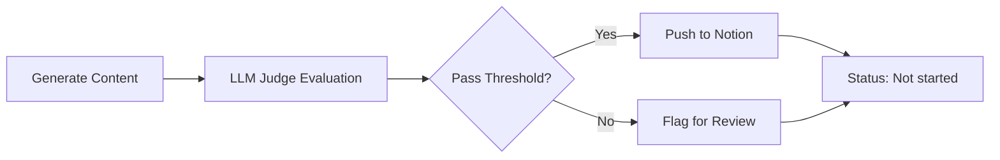
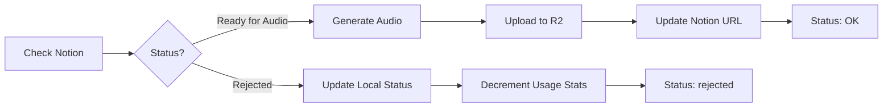

# Notion Integration Guide

This document explains how to set up and use the Notion integration for content review workflow.

## Overview

The Notion integration enables a human-in-the-loop review workflow for generated content:

1. **Generate** conversations/stories with automatic LLM quality evaluation
2. **Push** to Notion database for human review
3. **Review** in Notion: approve ("Ready for Audio") or reject
4. **Sync** status changes back to local files
5. **Generate** audio automatically for approved content

## Setup

### 1. Create Notion Integration

1. Go to [https://www.notion.so/my-integrations](https://www.notion.so/my-integrations)
2. Click "+ New integration"
3. Name it (e.g., "HavaChat Content Review")
4. Select the workspace
5. Copy the "Internal Integration Token"

### 2. Create Notion Database

Create a new database with the following columns:

| Column Name | Type | Description |
|------------|------|-------------|
| Type | Select | "conversation" or "story" |
| Title | Title | Content title |
| Description | Text | Content description |
| Topic | Text | Topic name (e.g., "Food", "Travel") |
| Scenario | Text | Scenario name (e.g., "Ordering at Restaurant") |
| Script | Text | Conversation/story text with speaker labels |
| Translation | Text | English translation |
| Audio | URL | R2 audio URL (populated after generation) |
| LLM Comment | Text | JSON of LLM judge evaluation |
| Human Comment | Text | Reviewer notes |
| Status | Select | Workflow status (see below) |

**Status values**:
- `Not started`: Initial state after push
- `Ready for Review`: Marked for human review
- `Reviewing`: Currently being reviewed
- `Ready for Audio`: Approved, pending audio generation
- `Rejected`: Rejected by reviewer
- `OK`: Audio generated, workflow complete

### 3. Share Database with Integration

1. Open your Notion database
2. Click "Share" in the top right
3. Invite your integration
4. Copy the database ID from the URL:
   - URL format: `https://www.notion.so/{workspace}/{database_id}?v=...`
   - Database ID is the 32-character hex string

### 4. Configure Environment Variables

Add to `.env`:

```bash
# Notion Integration
NOTION_API_TOKEN=secret_xxxxxxxxxxxxxxxxxxxxxxxxxxxxx
NOTION_DATABASE_ID=xxxxxxxxxxxxxxxxxxxxxxxxxxxxxxxx
```

## Usage

### Generate Content with LLM Judge & Notion Push

```bash
# Generate conversations with auto-evaluation and Notion push
uv run python -m havachat.cli.generate_content \
  --language zh --level HSK3 \
  --topic "Food" \
  --learning-items-dir ../havachat-knowledge/generated\ content/Chinese/HSK3/ \
  --output data/zh/HSK3/ \
  --type conversation \
  --num-conversations 5 \
  --enable-notion

# Skip LLM judge (push without evaluation)
uv run python -m havachat.cli.generate_content \
  --language zh --level HSK3 \
  --topic "Food" \
  --learning-items-dir ../havachat-knowledge/generated\ content/Chinese/HSK3/ \
  --output data/zh/HSK3/ \
  --type conversation \
  --enable-notion \
  --skip-judge
```

### Check Notion for Status Changes

```bash
# Process all status changes
uv run python -m havachat.cli.notion_sync --check-notion

# Process changes since specific timestamp
uv run python -m havachat.cli.notion_sync \
  --check-notion \
  --since "2026-01-31T10:00:00"
```

This command:
- Fetches pages with status "Ready for Audio" or "Rejected"
- For "Ready for Audio": generates audio, uploads to R2, updates Notion
- For "Rejected": updates local JSON status, decrements usage stats

### Regenerate Audio by Title

```bash
# Search and regenerate audio
uv run python -m havachat.cli.notion_sync \
  --regenerate-audio "Ordering Food" \
  --language zh \
  --level HSK3

# Handle duplicate titles (will show menu)
uv run python -m havachat.cli.notion_sync \
  --regenerate-audio "Shopping"
```

### Retry Failed Pushes

If some content failed to push to Notion (e.g., due to API errors), retry them:

```bash
uv run python -m havachat.cli.notion_sync --push-failed
```

## Workflow

### 1. Content Generation → Notion



### 2. Human Review in Notion

Reviewers work in Notion:
- Read content (Script, Translation)
- Check LLM Comment for quality assessment
- Add Human Comment for notes
- Update Status:
  - `Ready for Audio`: Approve for audio generation
  - `Rejected`: Reject (will update local status)
  - `Reviewing`: Mark as in progress

### 3. Notion → Local Sync



## Data Flow

### Content Mapping

The `notion_mapping.json` file tracks relationships:

```json
[
  {
    "content_id": "abc123",
    "notion_page_id": "xyz789",
    "language": "zh",
    "level": "HSK3",
    "type": "conversation",
    "title": "Ordering Food",
    "last_pushed_at": "2026-01-31T10:00:00",
    "last_synced_at": "2026-01-31T11:30:00",
    "status_in_notion": "OK",
    "status_in_local": "published"
  }
]
```

### Failed Push Queue

Failed pushes are queued in `notion_push_queue.jsonl` (newline-delimited JSON):

```json
{"content_id": "def456", "type": "story", "title": "A Day at School", "language": "ja", "level": "N5", "attempt_count": 3, "last_error": "API timeout", "failed_at": "2026-01-31T12:00:00", "payload": {...}}
```

## LLM Judge Evaluation

The LLM judge evaluates content on 6 dimensions:

1. **Naturalness** (1-10): Natural dialogue flow and phrasing
2. **Level Appropriateness** (1-10): Matches target level (HSK3, N5, etc.)
3. **Grammatical Correctness** (1-10): Grammar accuracy
4. **Vocabulary Diversity** (1-10): Variety of words and expressions
5. **Cultural Accuracy** (1-10): Culturally appropriate context
6. **Engagement** (1-10): Interesting and engaging content

**Overall Recommendation**:
- `proceed`: Average score ≥ 7.0, suitable for publication
- `review`: Average score < 7.0, needs human review

**Inconsistency Detection**: Flags cases where dimension scores differ by ≥4 points (e.g., naturalness=9, engagement=5)

### Example LLM Comment in Notion

```json
{
  "content_id": "abc123",
  "naturalness": {"score": 8, "explanation": "Natural dialogue flow with appropriate expressions"},
  "level_appropriateness": {"score": 9, "explanation": "Perfect for HSK3 level vocabulary"},
  "grammatical_correctness": {"score": 10, "explanation": "No grammar errors detected"},
  "vocabulary_diversity": {"score": 7, "explanation": "Good variety of words used"},
  "cultural_accuracy": {"score": 8, "explanation": "Culturally appropriate context"},
  "engagement": {"score": 7, "explanation": "Moderately engaging content"},
  "overall_recommendation": "proceed",
  "recommendation_justification": "High quality content suitable for publication",
  "has_inconsistency": false
}
```

## Troubleshooting

### Schema Validation Errors

If you see "Notion schema validation failed", verify:
1. All required columns exist in your database
2. Column types match (e.g., Status must be Select, not Text)
3. Status select has all required values

Run validation manually:
```python
from src.pipeline.utils.notion_client import NotionClient
client = NotionClient(api_token="...", database_id="...")
client.validate_database_schema()
```

### Missing Mappings

If `--check-notion` can't find content:
1. Check `notion_mapping.json` exists
2. Verify content was pushed with `--enable-notion`
3. Check mapping has correct notion_page_id

### Audio Generation Failures

If audio generation fails during sync:
1. Check R2 credentials
2. Verify voice config files exist
3. Check logs for ElevenLabs API errors

## Best Practices

1. **Always use `--enable-notion`** for production content generation
2. **Review LLM Comment** before approving in Notion
3. **Add Human Comment** for rejected items (helps improve prompts)
4. **Run `--check-notion` regularly** (e.g., every hour via cron)
5. **Monitor `notion_push_queue.jsonl`** for recurring failures
6. **Use `--since` parameter** to avoid re-processing old items

## Architecture Notes

- **Stateless CLI**: Each command call is independent
- **Manual triggers**: No polling or webhooks (controlled via CLI)
- **Idempotent operations**: Safe to re-run commands
- **Fail-safe**: Failed pushes queued for retry
- **Cascading updates**: Rejected items decrement usage stats for all linked learning items
